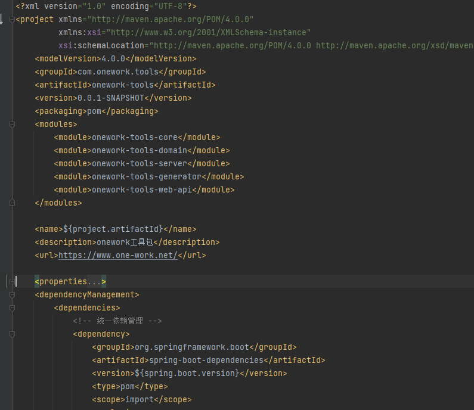
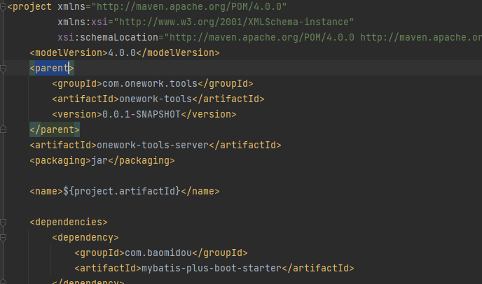
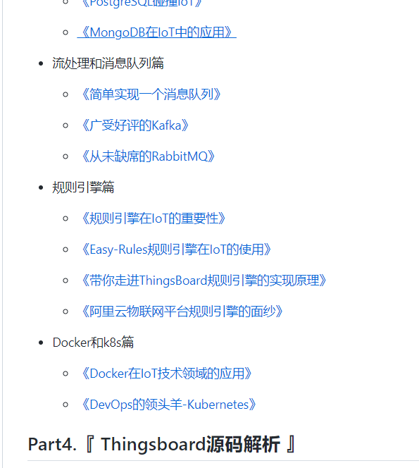

# OneWork-Tools 设计方案
# 一、概述
后端：设计方案-> 数据结构->接口设计->逻辑实现->模拟测试

前端：脚手架->功能目录->页面实现->接口联调

前端脚手架：多标签、路由导航、mock数据、scss编译、ts编译、UI组件

# 二、场景
（1）应用启动初始化模块、同时按模块初始化异常信息、功能等信息。

（2）应用启动初始化创建数据库脚本，插入种子数据

（3）常用图形验证码（滑动、随机数）

（4）解析OpenApi文档，生成Controller和Model代码

# 三、架构
**需求挖掘与分析**

该模块提供基础设施，定义模块和应用基本结构。

系统启动时，扫描项目依赖的模块和应用种子数据，初始化至数据库，提供后续维护基础数据。

**功能描述**

* 公共配置：第三方组件的配置（druid、mybaits、spring、swagger），
* 公共异常：`AppException`类（统一错误编码、异常区分模块）
* 判断辅助：`Check`类（非null判断、布尔判断）
* 模块扫描：启动扫描`BaseModule`继承类，同步模块异常信息
* 辅助类：`ExecuteResult`执行结果包裹器

spring event 事件驱动


# 四、功能
## （1）模块（module）
**需求挖掘与分析**

什么是“模块”？什么是“应用”？什么是“系统”？什么是“功能”?

“应用”该有那些操作？“应用”数据用途？“应用”数据结构该如何设计？

系统如何登记？系统登记需要什么参数？

模块如何注册？模块注册有什么用途？

> 模块，就好比是砖块、窗户、灶台这些相对某个范畴来说的基本元素。

> 子系统就是由模块构成的，具备该范畴所需部分功能支持的东西，例如卧室、厨房，或者说房间的电气布线。

> 系统就是指该范畴内能满足用户或客户所需的功能完备的一个实体，例如一套房子，它则是由上述子系统组成的。

> 而功能则是上述模块、子系统、系统在运转过程中所表现出来的行为和所产出的内容，模块由模块的功能，子系统有子系统的功能，系统也有系统的功能。

> 模块、子系统、系统都是相对来说的。例如，对于城市这个系统来说，一间房子、一栋大楼、一条道路就是模块，一个商区、一个行政区、一个河道交通，都可以看做是子系统。

应用：标识、名称、编码、描述、~~类型~~、

功能：ID、名称、类型（读、写、读写）、描述

模块：ID、名称、描述

应用包含多个功能

系统包含多个模块

模块包含多个功能

**功能**

* 应用管理
* 异常信息维护
* 功能管理：公共功能，应用功能，划分业务系统、运用系统、系统功能

## （2）认证（authentication）
**需求挖掘与分析**

用户、账户、人员、组织

用户对于多个账户，账户可以是手机号、用户名、邮箱地址、设备ID

用户如何进行注册？

* 手机号
* 邮箱
* 用户名
* 昵称&手机号
* 第三方（微信、QQ）


**功能**

* 注册用户（添加用户 ）
用户名、密码、昵称、手机、邮箱、性别、出生年月日
* 修改个人资料
* 找回密码
* 手机短信验证、邮箱验证
* 锁定用户、解锁用户
* 用户维护（查询、添加、修改、删除）

## （3）授权（authorize）
* 密码认证

* 二维码认证
* JWT验证
* 短信验证
* Oauth认证（微信、Github、支付宝）
* 辅助功能（验证码、访爆破、IP限制、白名单）

## （4）组织（organization）
* 机构
* 部门
* 人员
* 岗位

## （5）字典（dictionary）
* 选项字典
例如：行政区域
* 数据字典
例如：性别

## （6）表单（form）
* 表单
* 表单项

## （7）流程（flow）
* 流程
* 流程节点
* 节点关系

## （8）文件（file）
* 文件类型
* 文件

## （10）消息（message）
## （.）数据模型（model）
## （.）数据库结构辅助（database）
## （.）翻译辅助（translate）
# 五、插件
Spring Boot

lombok

org.apdplat.word

mybatis-plus

com.alibaba.fastjson

p6spy

mysql

# 六、其它
## （1）各类关系型数据库JDBC驱动及版本兼容
|排名|数据库|类型|得分|
| ----- | ----- | ----- | ----- |
|1|Oracle|关系型数据库|1345.00|
|2|MySQL|关系型数据库|1241.64|
|3|Microsoft SQL Server|关系型数据库|1037.64|
|4|PostgreSQL|关系型数据库|555.06|
|5|MongoDB|文档数据库|453.83|
|6|IBM Db2|关系型数据库|161.62|
|7|Redis|键值对（Key-value）数据库|155.42|
|8|Elasticsearch|搜索和数据分析引擎|151.55|
|9|SQLite|关系型数据库|123.31|
|10|Microsoft Access|关系型数据库|118.75|

## （2）领域模式划分项目层次结构，考虑代码生成器代码与业务代码合理
**onework-tools-core 层**

> 提供：eventbus、chche、job、message、log、authorize、authority 功能

**onework-tools-generator 层**

> 附属功能独立包，代码生成器工具

**onework-tools-domain 层**

> 领域服务包，包括各种业务功能实现，例如：用户身份验证、权限管理、数据库同步（database）、模型管理（model）等

**onework-tools-server 层**

> 提供web api或系统服务的数据支撑，面向具体终端，依赖domain层，结合mybaits实现domain层定义接口规范，同时提供终端数据组装

**onework-tools-web-api 层**

> 提供具体服务restfull api接口，同时包括各模块具体测试类和相关配置

## （3）多模块中Maven如何进行版本管理
通过Maven的POM文件继承功能，建立根POM，将版本放在properties标签中集中配置，dependencyManagement管理依赖包，dependencyManagement中依赖包版本通过\${xxx.version}进行配置，其他模块中POM文件直接在dependencies标签填写groupId、artifactId标签内容，这样其他模块POM文件继承根POM的版本

其中子模块只能有一个parent标签，导致springboot parent无法导入，可以使用spring-boot-dependencies方式解决

**根POM文件**



**子项目：**



## （4）如何简化Mybaits plus代码生成工具参数
利用构建者模式方进行构建，将参数封装Bean（get和set赋值和取值），便于后续提供外部接口

```java
GeneratorConfigValue generatorConfigValue = new GeneratorConfigValue();

        generatorConfigValue.getPackageConfigValue()
            .setParent("com.onework.tools.server")
            .setModuleName("database");

        generatorConfigValue.getTemplateConfigValue()
            .setDisableController(true);

        generatorConfigValue.getStrategyConfigValue()
            .setAddTablePrefix(new String[] { "ow_" })
            .setAddTableSuffix(new String[] { "s" })
            .setEnableCapitalMode(true)
            .setLikeTable(new LikeTable("database"))
        .getEntityBuilder()
            .setIdType(IdType.ASSIGN_ID)
            .setNaming(NamingStrategy.underline_to_camel)
            .setColumnNaming(NamingStrategy.underline_to_camel)
            .setLogicDeleteColumnName("deleted_at")
            .setEnableTableFieldAnnotation(true)
            .setAddTableFills( new IFill[] {
                    new Column("created_at", FieldFill.INSERT),
                    new Column("updated_at", FieldFill.INSERT_UPDATE),
                    new Column("deleted_at", FieldFill.DEFAULT),
            })
            .setEnableLombok(true).setEnableChainModel(true);

        GeneratorTool generatorTool = new GeneratorTool(fastAutoGenerator, generatorConfigValue);
        generatorTool.execute();
```
## （5）如何利用线程池高效执行批量数据插入
hutool工具类进行集合分页，利用ThreadPoolExecutor管理线程池，同时考虑数据库事务的阻塞

```java
final int pageSize = 10;
        int pageCount = (tables.size() + pageSize - 1) / pageSize;
        ThreadPoolExecutor threadPoolExecutor = ThreadUtil.newExecutor(pageCount, pageCount);
        for (int i = 0; i < pageCount; i++) {
            int page = i;
            threadPoolExecutor.execute(() -> {
                //                // 1.获取事务定义
                //                DefaultTransactionDefinition def = new DefaultTransactionDefinition();
                //                // 2.设置事务隔离级别，开启新事务
                //                def.setPropagationBehavior(TransactionDefinition.PROPAGATION_REQUIRES_NEW);
                //                TransactionStatus status = dataSourceTransactionManager.getTransaction(def);
                try {
                    List<Table> pageTables = CollUtil.page(page, pageSize, tables);
                    handleColumns(dbSchemaServer, pageTables);
                } catch (Exception ex) {
                    // dataSourceTransactionManager.rollback(status);
                    log.error(String.format("%s：批量提交失败", Thread.currentThread().getName()), ex);
                }
                // 3.提交事务
                //dataSourceTransactionManager.commit(status);
            });
        }
        while (true) {
            int count = threadPoolExecutor.getActiveCount();
            if (count == 0) {
                database.setLastSyncDate(LocalDateTime.now());
                database.setIsSync(true);
                databaseRepository.updateDatabase(database);
                threadPoolExecutor.shutdown();

                return executeResult.ok();
            }
        }
```
## （6）Mybaits plus 中如何手动控制事务操作
```java
// 1.获取事务定义
DefaultTransactionDefinition def = new DefaultTransactionDefinition();
// 2.设置事务隔离级别，开启新事务
def.setPropagationBehavior(TransactionDefinition.PROPAGATION_REQUIRES_NEW);
TransactionStatus status = dataSourceTransactionManager.getTransaction(def);
```
## （7）各类DTO数据映射，例如DTO、DAO、POCO对象之间转换工具
hutool中BeanUtil中的BeanUtil.copyProperties方法进行转换，减少手动赋值，后续考虑mapstruct

```java
    public static Column getColumn(DataColumn dataColumn, Table table) {

        Column column = BeanUtil.copyProperties(dataColumn, Column.class);
        column.setCnUid(table.getCnUid());
        column.setDbUid(table.getDbUid());
        column.setDbName(table.getDbName());
        column.setTbUid(table.getUid());
        column.setTbName(table.getName());
        return column;
    }
```
## （8）利用 p6spy包对sql语句分析与调试，Mppper批量时候生成具体sql语句
```xml
            <dependency>
                <groupId>p6spy</groupId>
                <artifactId>p6spy</artifactId>
                <version>3.9.1</version>
            </dependency>
```
**spy.properties文件**

```xml
#3.2.1以上使用
modulelist=com.baomidou.mybatisplus.extension.p6spy.MybatisPlusLogFactory,com.p6spy.engine.outage.P6OutageFactory
#3.2.1以下使用或者不配置
#modulelist=com.p6spy.engine.logging.P6LogFactory,com.p6spy.engine.outage.P6OutageFactory
# 自定义日志打印
logMessageFormat=com.baomidou.mybatisplus.extension.p6spy.P6SpyLogger
#日志输出到控制台
appender=com.baomidou.mybatisplus.extension.p6spy.StdoutLogger
# 使用日志系统记录 sql
#appender=com.p6spy.engine.spy.appender.Slf4JLogger
# 设置 p6spy driver 代理
deregisterdrivers=true
# 取消JDBC URL前缀
useprefix=true
# 配置记录 Log 例外,可去掉的结果集有error,info,batch,debug,statement,commit,rollback,result,resultset.
excludecategories=info,debug,result,commit,resultset
# 日期格式
dateformat=yyyy-MM-dd HH:mm:ss
# 实际驱动可多个
#driverlist=org.h2.Driver
# 是否开启慢SQL记录
outagedetection=true
# 慢SQL记录标准 2 秒
outagedetectioninterval=2
```
## （9）统一异常编码管理，如何划分各模块不同异常以及异常消息的集中管理
**基础异常**

```java
public abstract class BaseException extends RuntimeException {

    private static final long serialVersionUID = 7969689764816292922L;
    private final String code;
    private final Object[] formatParams;

    protected BaseException(String code) {
        this(code, null);
    }

    protected BaseException(String code, String[] formatParams) {

        this.code = code;
        this.formatParams = formatParams;
    }

    /**
     * 获取模块编码，便于区分不同模块异常
     *
     * @return
     */
    protected abstract String getModuleCode();

    @Override
    public String getMessage() {

        String message = "unknown unknown";
        String moduleCode = getModuleCode();
        String key = String.format("%s.%s", moduleCode, code);

        if (ErrorMessageManger.ErrorMessageCodeMap.containsKey(key)) {
            message = ErrorMessageManger.ErrorMessageCodeMap.get(key);
        }

        if (formatParams != null) {
            message = String.format(message, formatParams);
        }

        return message;
    }
}
```
**异常消息管理**

```java
@Component
public class DomainDatabaseModule implements ModuleInfo {

    /**
     * 模块异常编号
     */
    public final static String MODULE_CODE = "2001";

    // region 异常常量

    public final static String DB_TYPE_IS_NULL = "0001";

    public final static String CONNECTION_NAME_IS_NULL = "0002";

    public final static String DB_HOST_IS_NULL = "0003";

    public final static String DB_USER_IS_NULL = "0004";

    public final static String DB_PASSWORD_IS_NULL = "0005";

    public final static String DB_CONNECTION_ERROR = "0006";

    public final static String DB_SCHEMA_SERVER_ERROR = "0007";

    public final static String SYSC_CONNECTION_ERROR = "0008";
    public final static String SYSC_CONNECTION_DATABASE_ERROR = "0009";
    public final static String SYSC_DATABASE_CONNECTION_ERROR = "0010";
    public final static String SYSC_TABLE_ERROR = "0011";


    //endregion

    @Override
    public String getModuleCode() {
        return MODULE_CODE;
    }

    @Override
    public Map<String, String> getErrorCodeMap() {
        return new Hashtable<String, String>() {{

            put(DB_TYPE_IS_NULL, "数据库类型不能为空");
            put(CONNECTION_NAME_IS_NULL, "数据库连接名称不能为空");
            put(DB_HOST_IS_NULL, "数据库连接地址不能为空");
            put(DB_USER_IS_NULL, "数据库连接用户不能为空");
            put(DB_PASSWORD_IS_NULL, "数据库连接密码不能为空");
            put(DB_CONNECTION_ERROR, "数据库连接失败");
            put(DB_SCHEMA_SERVER_ERROR, "获取数据库结构服务异常");

            put(SYSC_CONNECTION_ERROR, "同步数据数库，数据库连接异常，连接名称：%s");
            put(SYSC_CONNECTION_DATABASE_ERROR, "同步数据库，数据库异常，数据库名称：%s");
            put(SYSC_DATABASE_CONNECTION_ERROR, "同步数据库,数据连接异常，数据库名称：%s");
            put(SYSC_TABLE_ERROR, "同步数据库%表异常");
        }};
    }
}

```
## （10）包装方法执行结果，对执行结果进行包装，便于判断
```java
public class ExecuteResult {

    public final static ExecuteResult SUCCESS = new ExecuteResult(true);

    public final static ExecuteResult FAIL = new ExecuteResult(false);

    private boolean result;

    public ExecuteResult() {

        result = false;
    }

    public ExecuteResult(Boolean result) {

        this.result = result;
    }

    public ExecuteResult ok() {
        result = true;
        return this;
    }

    public ExecuteResult fail() {
        result = false;
        return this;
    }

    public <T extends Throwable> ExecuteResult fail(T t) {
        result = false;
        return this;
    }

    public boolean equals(ExecuteResult o) {
        return o.result == result;
    }
```
（11）使用RestTemplate做api请求，并编写拦截器进行日志记录，对于Steam对象只能读取一次，不能进行多次读取

（12）如何Spring boot 启动嵌入初始化操作

**@PostConstruct**

对于注入到Spring容器中的类，在其成员函数前添加@PostConstruct注解，则在执行Spring beans初始化时，就会执行该函数。
但由于该函数执行时，其他Spring beans可能并未初始化完成，因此在该函数中执行的初始化操作应当不依赖于其他Spring beans。

```bash
@Component
public class Construct {
    @PostConstruct
    public void doConstruct() throws Exception {
        System.out.println("初始化：PostConstruct");
    }
}
```
**CommandLineRunner**

```bash
@Component
public class InitCommandLineRunner implements CommandLineRunner {
    @Override
    public void run(String... args) throws Exception {
        System.out.println("初始化：InitCommandLineRunner");
    }
}
```
**ApplicationRunner**

```bash
@Component
public class InitApplicationRunner implements ApplicationRunner {
    @Override
    public void run(ApplicationArguments applicationArguments) throws Exception {
        System.out.println("初始化：InitApplicationRunner");
    }
}
```
---
寻找方案：

* [https://github.com/authorwlh/wlhbdp](https://github.com/authorwlh/wlhbdp)

* [https://github.com/phodal/migration](https://github.com/phodal/migration)

[http://jeecg.com/](http://jeecg.com/)

指南中所包含的书单：

* 《重构与模式》
* 《设计模式：可复用面向对象软件的基础》
* 《重构：改善既有代码的设计》
* 《领域驱动设计：软件核心复杂性应对之道》
* 《修改代码的艺术：构建易维护代码的 9 条最佳实践》
* 《代码整洁之道》
* 《架构整洁之道》
* 《数据库重构》
* 《遗留系统重构指南》
* 《软件架构师应该知道的97件事》
* 《架构师修炼之道》
* 《实现模式》
* 《反模式：危机中的软件，架构和项目的重构》
* 《精益软件度量》
* 《设计模式沉思录》
* 《前端架构：从入门到微前端》

[https://github.com/IoT-Technology/IoT-Technical-Guide](https://github.com/IoT-Technology/IoT-Technical-Guide)



前端

vue-pure-admin：[https://pure-admin-doc.vercel.app/](https://pure-admin-doc.vercel.app/)

```bash
├── .github (可选)                                          # GitHub Actions 配置文件
├── .husky (可选)                                           # 提交校验配置文件
├── .vscode (可选)                                          # IDE工具推荐配置文件（开发辅助）
├── build						      # 构建工具
├── mock                                                    # mock 模拟后台数据
├── node_modules                                            # 模块包
├── public                                                  # 静态资源
├── src							        👉 项目源代码
├── types                                                   # 全局 TS 类型配置
├── .editorconfig                                           # 编辑器读取文件格式及样式定义配置
├── .env                                                    # 全局环境变量配置
├── .env.development                                        # 开发环境变量配置
├── .env.production                                         # 生产环境变量配置
├── .eslintignore                                           # eslint 语法检查忽略文件
├── .eslintrc.js                                            # eslint 语法检查配置
├── .gitignore                                              # git 提交忽略文件
├── .gitpod.yml（可选）
├── .markdownlint.json                                      # markdown 格式检查配置
├── .prettierrc.js                                          # prettier 插件配置
├── .stylelintignore                                        # stylelint 插件检查忽略文件
├── babel.config.js                                         # babel 编译配置(移除 console)
├── CHANGELOG.en_US.md（可选）
├── CHANGELOG.md（可选）
├── CHANGELOG.zh_CN.md                                      # 改动日志记录
├── commitlint.config.js                                    # git 提交检查配置
├── index.html                                              # html 主入口
├── LICENSE                                                 # 证书
├── package.json                                            # 依赖包管理 JSON 文件
├── pnpm-lock.yaml                                          # 依赖包版本内容锁定文件(不要改动！)
├── postcss.config.js                                       # postcss 插件配置
├── README.en-US.md（可选）
├── README.md                                               # README
├── stylelint.config.js                                     # stylelint 插件配置
├── tsconfig.json                                           # ts 配置
└── vite.config.ts                                          # vite 配置
```
如果您使用的 IDE 是 vscode(推荐)的话，可以安装以下工具来提高开发效率及代码格式化

> * WindiCSS IntelliSense WindiCSS 自动完成、语法突出显示、代码折叠和构建等高级功能
> * TypeScript Vue Plugin (Volar) 用于 TypeScript 服务器的 Vue 插件
> * Vue Language Features (Volar) Vue3.0 语法支持
> * Iconify IntelliSense Iconify 预览和搜索
> * i18n Ally 国际化智能提示
> * Stylelint css 格式化
> * DotENV .env 文件高亮
> * Prettier 代码格式化
> * ESLint 脚本代码检查

---
